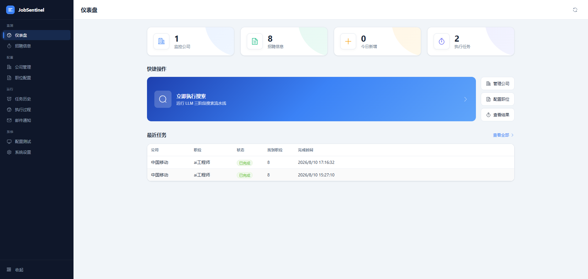
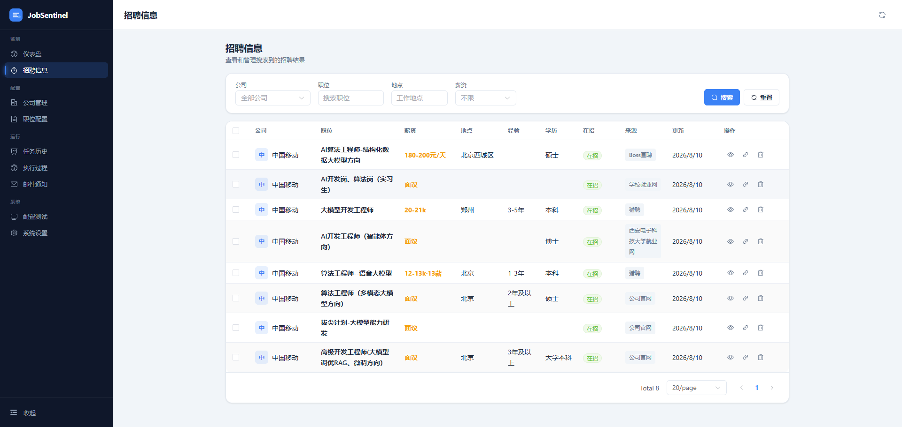
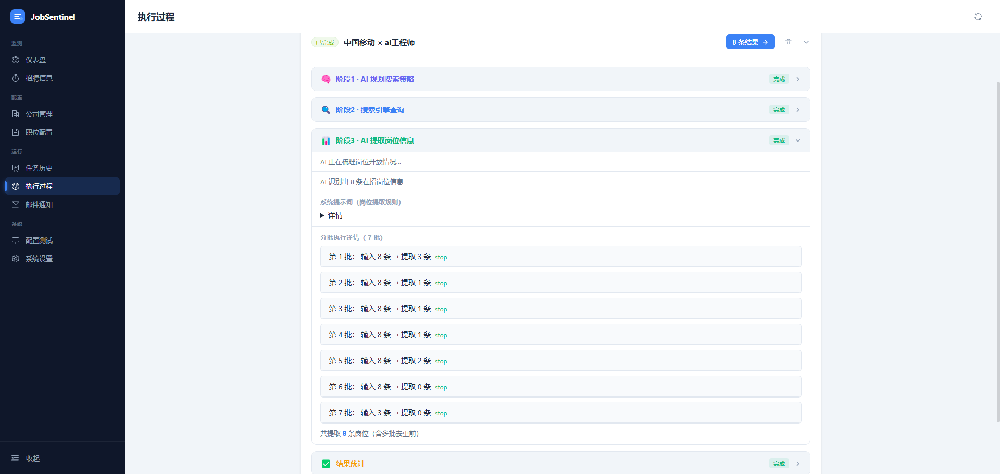

# JobSentinel

> 基于 AI 的招聘信息自动搜索与监测系统 —— 让大模型主导搜索策略，自动监测目标公司、目标岗位的招聘开放情况，第一时间发现新的投递入口。

JobSentinel 维护一份「公司 × 职位」的监测清单，按需手动触发或定时 cron 触发，由 LLM 自动规划搜索查询词、调用 SerpAPI 搜索、再由 LLM 从搜索结果中提取结构化的在招岗位信息（含可点击的原始链接），统一入库供筛选、查看与跟踪。每次搜索任务结束后自动发送邮件报告，并在数据库中留一条 EmailLog 供追溯。

---

## ✨ 核心特性

- **LLM 主导的三阶段搜索流水线**
  1. **规划**：把公司 + 职位信息交给大模型，输出结构化搜索策略（查询词、目标平台、关键词、排除词、思路），并自动生成 `site:` 限定查询覆盖公司官方招聘页。
  2. **搜索**：照策略调用 SerpAPI（Google）查询，按链接去重并汇总。
  3. **梳理**：把搜索结果分批交回 LLM，提取岗位开放信息（是否在招、来源平台、**原始链接必填**、地点、薪资、技能等），按 `source_url` 去重后入库。
- **任务执行可视化**：每个搜索任务的每一阶段进度、提示词、LLM 原始输出、每查询词命中明细都写入 `steps_log`，前端「执行过程」页可逐步展开复盘，便于定位搜索到底卡在哪一步。
- **定时任务调度**：基于 APScheduler 的 `BackgroundScheduler`，按 cron 表达式定期执行「全部启用公司 × 启用职位」的批量搜索；支持 cron 合法性校验与运行时热更新，无需重启进程。
- **搜索完成邮件报告**：每次手动或定时触发的批量搜索结束后，自动汇总任务结果（含新增岗位数、成功/失败计数）通过 SMTP 发送 HTML 邮件给 `EMAIL_TO_LIST`，并在「邮件通知」页可查询历史发送记录（成功 / 失败 / 跳过均有记录）。
- **兼容多种大模型服务**：通过 OpenAI 兼容接口接入 OpenAI / Anthropic / Ollama / vLLM / 第三方代理 / Azure OpenAI，只需配置 `LLM_API_BASE_URL` 与 `LLM_API_KEY`。
- **开箱即用**：默认使用本地 SQLite，零配置即可启动；如需 PostgreSQL/Supabase，改一行 `DATABASE_URL` 即可。
- **现代化前端**：Vue 3 + Element Plus + TypeScript + Vite，9 个功能页面，axios 封装与路由守卫一应俱全。

> 想了解"系统是如何一步步处理的"，请阅读 [docs/PIPELINE.md](docs/PIPELINE.md)。
> 想深入了解各功能模块的技术实现细节，请阅读 [docs/FEATURES.md](docs/FEATURES.md)。
> 大模型配置场景示例请阅读 [docs/LLM_CONFIG.md](docs/LLM_CONFIG.md)。

---

## 📸 界面截图（部分示例）

> 以下为部分界面截图示意，完整功能页面包括：仪表盘 / 公司管理 / 职位配置 / 招聘信息 / 任务历史 / 执行过程 / 邮件通知 / 系统设置 / 配置测试。

### 仪表盘

监控总览、统计卡片、一键触发搜索入口。

<p align="center">
  
</p>

### 招聘信息

多条件筛选、分页检索在招岗位。

<p align="center">
  
</p>

### 执行过程

三阶段任务执行的分步复盘。

<p align="center">
  
</p>

---

## 🧩 使用功能一览

| 功能区 | 你可以在里面做什么 |
|--------|-------------------|
| 仪表盘 | 查看监测的公司数、职位数、今日新增、任务数总览；点「立即执行」一键发起搜索 |
| 公司管理 | 添加、编辑、删除要持续监测的目标公司，维护其官网与招聘页地址 |
| 职位配置 | 为各公司配置要盯的职位（关键词、排除词、目标城市），可按需启用或停用 |
| 招聘信息 | 多条件筛选、分页浏览已采集到的在招岗位，一键跳转原始招聘链接 |
| 任务历史 | 查看手动 / 定时触发的所有搜索任务及各自的完成状态 |
| 执行过程 | 展开单个任务，可以看到系统都做了什么工作，逐步复盘「规划 → 搜索 → 梳理」三个阶段及每一步的原始输出 |
| 系统设置 | 配置定时任务的运行时间与启停、SMTP 邮箱参数，保存后实时生效 |
| 邮件通知 | 查看每次搜索完成后的邮件报告发送记录（成功 / 失败 / 跳过） |
| 配置测试 | 无需跑真实任务，逐个验证 LLM / SerpAPI / SMTP 三个外部服务是否连通 |

---

## 🏗️ 项目架构

```
JobSentinel/
├── backend/                    # FastAPI 后端
│   ├── app/
│   │   ├── main.py             # 应用入口（lifespan: 建库 / 清理僵尸任务 / 启停调度器）
│   │   ├── core/config.py      # Pydantic Settings 配置（读 .env）
│   │   ├── models/             # SQLAlchemy 模型（Company / PositionConfig / SearchTask / JobListing / Schedule / EmailLog）
│   │   ├── schemas/            # Pydantic 请求/响应模型
│   │   ├── api/                # 路由模块（companies / positions / jobs / tasks / schedules / email / email_logs）
│   │   ├── agents/search_agent.py   # 三阶段搜索 Agent（规划 → 搜索 → 提取）
│   │   ├── tools/search_tools.py    # SerpAPI 搜索工具
│   │   ├── services/
│   │   │   ├── search_service.py    # 任务编排 + 进度写入 + 结果入库
│   │   │   └── email_service.py     # SMTP 邮件发送 + EmailLog 落库
│   │   ├── templates/email/    # Jinja2 邮件 HTML 模板
│   │   └── scheduler/          # APScheduler 定时任务（init/reschedule/shutdown）
│   ├── alembic/                # 数据库迁移工具（已配置，默认靠 init_db() 自动建表）
│   ├── requirements.txt
│   ├── Dockerfile
│   └── .env.example
├── frontend/                   # Vue 3 前端
│   ├── src/
│   │   ├── api/index.ts        # axios 封装 + 各业务 API
│   │   ├── router/index.ts     # 9 个路由 + 守卫
│   │   ├── views/              # 仪表盘 / 公司管理 / 职位配置 / 招聘信息 / 任务历史 / 执行过程 / 邮件通知 / 系统设置 / 配置测试
│   │   ├── components/AppLayout.vue
│   │   ├── utils/cronUtils.ts  # cron ↔ 友好配置互转
│   │   └── stores/
│   ├── vite.config.ts          # 端口 5173 + /api 代理到 8000
│   └── package.json
├── docs/
│   ├── FEATURES.md             # 功能与技术实现详解
│   ├── PIPELINE.md             # 系统处理流程速览
│   └── LLM_CONFIG.md           # 大模型配置指南
├── docker-compose.yml
├── LICENSE
└── README.md
```

---

## 🔧 技术栈

| 层 | 技术 |
|----|------|
| 后端 | FastAPI · Uvicorn · SQLAlchemy 2.0 · Pydantic v2 · APScheduler · aiosmtplib · Jinja2 |
| 数据库 | SQLite（默认，零配置）/ PostgreSQL（可选） |
| AI / 搜索 | OpenAI SDK（兼容多种 LLM）· Anthropic SDK · SerpAPI（GoogleSearch） |
| 前端 | Vue 3 · Element Plus · Vue Router · Pinia · TypeScript · Vite |
| 部署 | Docker · docker-compose |

---

## 🚀 快速开始

### 前置要求

- Python ≥ 3.11
- Node.js ≥ 18
- 一个 SerpAPI Key（[serpapi.com](https://serpapi.com) 注册，有免费额度）
- 一个 LLM API Key（OpenAI / Anthropic / 本地 Ollama 等，任选其一）
- 可选：SMTP 邮箱配置（开启搜索完成邮件通知功能）

### 1. 配置后端

```bash
cd backend

# 创建虚拟环境
python -m venv venv
# Windows:    venv\Scripts\activate
# Linux/Mac: source venv/bin/activate

# 安装依赖
pip install -r requirements.txt

# 复制环境变量模板并填入配置
cp .env.example .env
```

编辑 `backend/.env`，至少填入以下三项：

```env
DATABASE_URL=sqlite:///./jobsentinel.db（默认，可不动）

SERPAPI_KEY=你的serpapi_key

LLM_API_KEY=你的llm_api_key
LLM_API_BASE_URL=https://api.openai.com/v1   # 或 Ollama/vLLM/第三方代理地址
LLM_MODEL_NAME=gpt-4o                         # 或 qwen2:7b / llama3:8b / claude-3-5-sonnet-20241022
```

> 大模型配置的完整说明见 [docs/LLM_CONFIG.md](docs/LLM_CONFIG.md)。

### 2. 启动后端

```bash
cd backend
python run.py
# 服务运行在 http://localhost:8000
# API 文档：http://localhost:8000/docs
```

### 3. 配置并启动前端

```bash
cd frontend
npm install
npm run dev
# 前端运行在 http://localhost:5173（已配置 /api 代理到后端 8000）
```

打开浏览器访问 `http://localhost:5173` 即可使用。

### 4. 验证链路

1. 在「公司管理」页添加要监测的公司（可填官网、招聘页）。
2. 在「职位配置」页添加要监测的职位（关键词、排除词、目标城市）。
3. 在「系统设置」页或后端 `.env` 把 `SCHEDULE_ENABLED` 设为 `false`（默认关闭，先手动验证）。
4. 在「仪表盘」点「立即执行搜索」，到「招聘信息」页确认结果入库。
5. 到「执行过程」页查看任务的分阶段执行详情（规划策略、搜索命中、LLM 提取结果）。
6. （可选）在「系统设置」或「配置测试」页填入 SMTP 配置后，到「配置测试」页发一封测试邮件，确认无误即可启用定时任务让系统自动发送搜索报告。

也可直接用诊断接口快速验证：
- 测 LLM 连通：`GET http://localhost:8000/api/tasks/test-llm`
- 测整条搜索流水线：`GET http://localhost:8000/api/tasks/test-search?company=ByteDance&position=Python`

---

## 🐳 Docker 部署

```bash
# 在项目根目录
docker-compose up --build
# 后端 → localhost:8000，前端 → localhost:5173
```

> `docker-compose.yml` 中的前端服务为开发模式。生产部署建议后端上 Railway、前端构建静态产物后上 Vercel/Nginx，并相应调整 `CORS_ORIGINS` 与 `VITE_API_BASE_URL`。

---

## 📡 主要 API 一览

| 模块 | 方法 | 路径 | 说明 |
|------|------|------|------|
| 公司管理 | GET/POST/PUT/DELETE | `/api/companies/` | 增删改查 + 软删除/启用 |
| 职位配置 | GET/POST/PUT/DELETE | `/api/positions/` | 增删改查 + 软删除/启用 |
| 招聘信息 | GET/DELETE | `/api/jobs/` | 多条件筛选 + 分页（公司/关键词/地点/薪资/平台/验证状态） |
| 任务执行 | POST | `/api/tasks/run` | 手动触发搜索（预创建任务后后台执行） |
| 任务执行 | GET | `/api/tasks/` `/api/tasks/{id}` | 任务列表 / 详情（含 `steps_log`） |
| 定时任务 | GET/PUT | `/api/schedules/current` | 读取/热更新 cron 与启停（含下次执行时间） |
| 邮件服务 | GET | `/api/email/config` | 查看 SMTP 配置状态 |
| 邮件服务 | POST | `/api/email/test` | 发送一封示例报告邮件（验证 SMTP 链路） |
| 邮件日志 | GET/DELETE | `/api/email-logs/` `/api/email-logs/{id}` | 查询/删除邮件发送历史 |
| 仪表盘 | GET | `/api/dashboard/stats` | 公司数 / 岗位数 / 今日新增 / 任务数 |
| 诊断 | GET | `/api/tasks/test-llm` | 验证 LLM 连接 |
| 诊断 | GET | `/api/tasks/test-search` | 同步跑完整三阶段流水线，不写库 |
| 健康 | GET | `/health` | 健康检查 |

完整接口文档见启动后的 `/docs`（Swagger UI）。

---

## 🗃️ 数据模型

- **Company（公司）**：名称、别名、官网、招聘页、行业、启用状态
- **PositionConfig（职位配置）**：职位名、关键词、排除词、目标城市、经验级别、启用状态
- **SearchTask（搜索任务）**：公司 × 职位的一次执行，含状态、当前阶段、进度、步骤日志、职位数
- **JobListing（招聘信息）**：职位名、是否在招、来源平台、原始链接、薪资、地点、技能等
- **Schedule（定时任务）**：cron 表达式、启停（当前实际从 `.env` / 内存 settings 读取）
- **EmailLog（邮件发送记录）**：触发来源（手动/定时）、状态（成功/失败/跳过）、主题、收件人、关联任务、耗时

---

## ⚙️ 定时任务与邮件报告

默认配置（`.env`）：

```env
SCHEDULE_CRON=0 9 * * *      # 每天 09:00（Asia/Shanghai）
SCHEDULE_ENABLED=false        # 默认关闭

SMTP_HOST=smtp.gmail.com
SMTP_PORT=587
SMTP_USERNAME=your-email@gmail.com
SMTP_PASSWORD=your-app-password
EMAIL_FROM=your-email@gmail.com
EMAIL_TO_LIST=["recipient1@example.com"]
```

- 在前端「系统设置」页修改 cron 或启停，会立即热更新调度器（无需重启），并返回下次执行时间。
- 调度器对错过的触发容忍 1 小时（`misfire_grace_time=3600`），多次错过只补跑一次（`coalesce=True`）。
- 进程重启时会自动清理上次未结束的「僵尸」任务（`running`/`planning` 状态标为 `failed`）。
- 每次手动触发（`/api/tasks/run`）或定时触发（cron）完成的批量搜索，都会自动调用 `EmailService.send_search_report` 发送 HTML 邮件报告；无论发送成功 / 失败 / 因配置缺失跳过，都会写入一条 `EmailLog`，可在「邮件通知」页查询。
- SMTP 未配置或 `EMAIL_TO_LIST` 为空时跳过发送，不影响搜索任务本身。

---

## 📋 现状与路线图

- 后端 7 个 API 模块（companies / positions / jobs / tasks / schedules / email / email_logs）
- LLM 主导的三阶段搜索流水线（含任务执行可视化 steps_log）
- APScheduler 定时任务调度（含热更新 + cron 合法性校验）
- 搜索完成邮件通知（SMTP + Jinja2 HTML 模板 + EmailLog 历史记录）
- 仪表盘统计 + 多条件招聘信息检索 + 任务历史
- 前端 9 个页面 + 路由 + axios 封装 + Element Plus
- 「配置测试」页：一站式验证 LLM / SerpAPI / SMTP 三类外部服务连通性

---

## 📄 许可证

[MIT License](LICENSE) © 2026 JobSentinel Contributors
